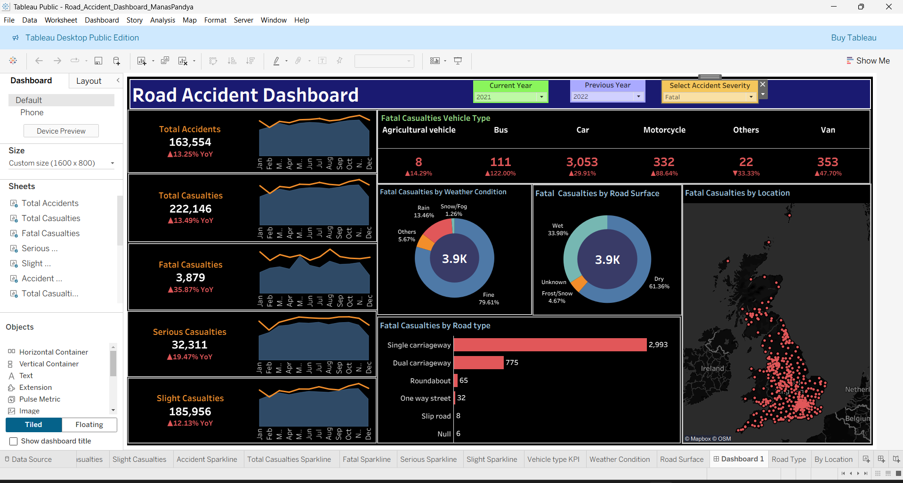

# road-accident-dashboard-uk
Tableau dashboard analyzing UK road accidents by severity, weather, and road type.  
  
# Road Accident Dashboard – UK Districts  
**Author:** Manas Pandya   
**Tool:** Tableau (.twbx + .hyper)   
  
--- 
## 🌐 Live Dashboard  
  
> Click the image above to view the interactive Tableau dashboard online (no login needed).  
  

---
  
## Project Overview  
This project analyzes patterns behind road accidents in the UK to answer:  
- Which road types are most dangerous?  
- Do weather and road conditions affect severity?  
- Are certain vehicles involved in fatal crashes more often?  
  
The dashboard provides a visual story of accident severity, conditions, and trends across UK districts.  
  
---  
  
## Key Features  
- KPI Tiles: Total, Fatal, Serious, Slight Accidents (+ YoY change)  
- Line Chart: Monthly trend of accidents  
- Donut Charts: Weather and Road Surface breakdown  
- Bar Chart: Casualties by Road Type  
- Map: UK accident hotspots  
- Table: Severity by Vehicle Type  
- Filters: Year, Severity, and Vehicle Type  
  
--- 

## How to View  
### Option 1 – View Offline  
1. Download the file [`ITe5421_project.twbx`](workbook/Road_Accident_Dashboard_ManasPandya.twbx)  
2. Install the free [Tableau Reader](https://www.tableau.com/products/reader/download)  
3. Open the `.twbx` file and explore the interactive dashboard offline  
  
### Option 2 – Download the Data  
- [`accident_data.csv`](data/accident_data.csv)  
- [`ITE5421_Project_AccidentData.hyper`](data/Project_AccidentData.hyper)  
  
### Option 3 – Read the Report  
- [`ITE5421-Project_Part2_Manas_Vatsal.docx`](report/Accident_Report_CaseStudy.docx)  
  
---  
  
## Insights  
- Most **fatal accidents** happen in **clear weather** and on **dry roads**, surprisingly.  
- **Single carriageways** are the most dangerous road type.  
- **Cars** are involved in most fatal crashes.  
- Although total accidents are decreasing, **fatal ones remain common** in cities like London and Manchester.  
